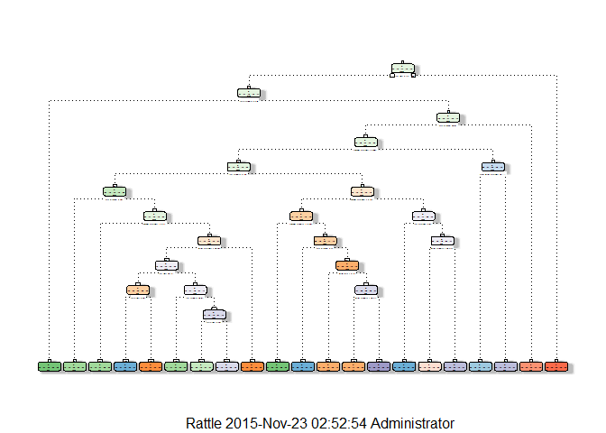
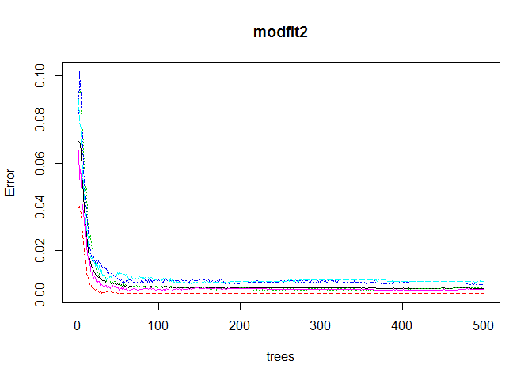

### Introduction

**Background**

Using devices such as Jawbone Up, Nike FuelBand, and Fitbit it is now
possible to collect a large amount of data about personal activity
relatively inexpensively. These type of devices are part of the
quantified self movement – a group of enthusiasts who take measurements
about themselves regularly to improve their health, to find patterns in
their behavior, or because they are tech geeks. One thing that people
regularly do is quantify how much of a particular activity they do, but
they rarely quantify how well they do it. In this project, your goal
will be to use data from accelerometers on the belt, forearm, arm, and
dumbell of 6 participants. They were asked to perform barbell lifts
correctly and incorrectly in 5 different ways. More information is
available from the [website](http://groupware.les.inf.puc-rio.br/har) .

**Data** The training data for this project are available here:

(<https://d396qusza40orc.cloudfront.net/predmachlearn/pml-training.csv>)

The test data are available here:

(<https://d396qusza40orc.cloudfront.net/predmachlearn/pml-testing.csv>)

The data for this project come from this source:

(<http://groupware.les.inf.puc-rio.br/har>).

**Goal**

The goal of your project is to predict the manner in which they did the
exercise. This is the "classe" variable in the training set. You may use
any of the other variables to predict with. You should create a report
describing how you built your model, how you used cross validation, what
you think the expected out of sample error is, and why you made the
choices you did. You will also use your prediction model to predict 20
different test cases.

### Loading and Cleaning Data

Preparing

    Sys.setlocale("LC_ALL",locale="english")
    library("caret")

    ## Loading required package: lattice
    ## Loading required package: ggplot2

    library("rpart")
    library("rattle")

    ## Rattle: A free graphical interface for data mining with R.
    ## XXXX 4.0.0 Copyright (c) 2006-2015 Togaware Pty Ltd.
    ## Type 'rattle()' to shake, rattle, and roll your data.

    library("randomForest")

    ## randomForest 4.6-12
    ## Type rfNews() to see new features/changes/bug fixes.

    set.seed(12345)

First, loading data.

    setwd("e:/data") # set your own work directory
    training=read.csv( "pml-training.csv",  na.strings=c("NA","#DIV/0!",""))
    testing=read.csv( "pml-testing.csv",  na.strings=c("NA","#DIV/0!",""))

Second, Cleaning data.

Remove the Columns with all NA.

    a=0
    for(i in 1:dim(training)[2]){
        if(all(is.na(training[,i])))
            a[i]=i
    }
    a=na.omit(a[-1])
    train=training[,-a]
    test=testing[,-a]
    remove(a);remove(i)

Cleaning variables with more than 70% NA.

    b = 0
    for(i in 1:dim(train)[2] ){
        if( !is.na( table(is.na(train[,i]))[2]/dim(train)[1] ) ){
            if( table(is.na(train[,i]))[2]/dim(train)[1] >=0.7 )
                b[i]=i
        }
    }
    b=na.omit(b[-1])
    train=train[,-b]
    test=test[,-b]
    remove(b);remove(i)
    remove(training);remove(testing)

Cleaning the irrelevant variables (like username, rowtime, new\_window
etc. )

    train=train[,-(1:6)]
    test=test[,-(1:6)]

Partioning the training set into two, 70% for train2, 30% for test2:

    inTrain = createDataPartition(y=train$classe,p=0.7, list=FALSE)
    train2 = train[inTrain,]
    test2 = train[-inTrain,]
    dim(train2); dim(test2)

    ## [1] 13737    54

    ## [1] 5885   54

### Predicting with Decision Tree

Building up decision tree.

    modfit1 = rpart(classe ~ ., data=train2,method = "class")

    fancyRpartPlot(modfit1)

    pred1= predict(modfit1, test2, type = "class")
    confusionMatrix(pred1, test2$classe)

    ## Confusion Matrix and Statistics
    ## 
    ##           Reference
    ## Prediction    A    B    C    D    E
    ##          A 1530  269   51   79   16
    ##          B   35  575   31   25   68
    ##          C   17   73  743   68   84
    ##          D   39  146  130  702  128
    ##          E   53   76   71   90  786
    ## 
    ## Overall Statistics
    ##                                          
    ##                Accuracy : 0.7368         
    ##                  95% CI : (0.7253, 0.748)
    ##     No Information Rate : 0.2845         
    ##     P-Value [Acc > NIR] : < 2.2e-16      
    ##                                          
    ##                   Kappa : 0.6656         
    ##  Mcnemar's Test P-Value : < 2.2e-16      
    ## 
    ## Statistics by Class:
    ## 
    ##                      Class: A Class: B Class: C Class: D Class: E
    ## Sensitivity            0.9140  0.50483   0.7242   0.7282   0.7264
    ## Specificity            0.9014  0.96650   0.9502   0.9100   0.9396
    ## Pos Pred Value         0.7866  0.78338   0.7543   0.6131   0.7305
    ## Neg Pred Value         0.9635  0.89051   0.9422   0.9447   0.9384
    ## Prevalence             0.2845  0.19354   0.1743   0.1638   0.1839
    ## Detection Rate         0.2600  0.09771   0.1263   0.1193   0.1336
    ## Detection Prevalence   0.3305  0.12472   0.1674   0.1946   0.1828
    ## Balanced Accuracy      0.9077  0.73566   0.8372   0.8191   0.8330

From the confusion Matrix we know thar the accuracy of decision tree is
only 73.68%. If we use other method with cross validation like random
forests, the result maybe more better.

### Predicting with Random forests.

    modfit2 = randomForest(classe ~ ., data=train2, method="class")
    pred2= predict(modfit2, test2, type = "class")
    plot(modfit2)

    confusionMatrix(pred2, test2$classe)

    ## Confusion Matrix and Statistics
    ## 
    ##           Reference
    ## Prediction    A    B    C    D    E
    ##          A 1674    5    0    0    0
    ##          B    0 1133    8    0    0
    ##          C    0    1 1018   12    0
    ##          D    0    0    0  952    4
    ##          E    0    0    0    0 1078
    ## 
    ## Overall Statistics
    ##                                           
    ##                Accuracy : 0.9949          
    ##                  95% CI : (0.9927, 0.9966)
    ##     No Information Rate : 0.2845          
    ##     P-Value [Acc > NIR] : < 2.2e-16       
    ##                                           
    ##                   Kappa : 0.9936          
    ##  Mcnemar's Test P-Value : NA              
    ## 
    ## Statistics by Class:
    ## 
    ##                      Class: A Class: B Class: C Class: D Class: E
    ## Sensitivity            1.0000   0.9947   0.9922   0.9876   0.9963
    ## Specificity            0.9988   0.9983   0.9973   0.9992   1.0000
    ## Pos Pred Value         0.9970   0.9930   0.9874   0.9958   1.0000
    ## Neg Pred Value         1.0000   0.9987   0.9984   0.9976   0.9992
    ## Prevalence             0.2845   0.1935   0.1743   0.1638   0.1839
    ## Detection Rate         0.2845   0.1925   0.1730   0.1618   0.1832
    ## Detection Prevalence   0.2853   0.1939   0.1752   0.1624   0.1832
    ## Balanced Accuracy      0.9994   0.9965   0.9948   0.9934   0.9982

Random Forests gave an accuracy in the test2 dataset of 99.49%, which
was more accurate than Decision Trees . The expected out-of-sample error
is 100 - 99.49 = 0.51%.

### Predicting Results on the Test Data

Using same method to predicit the Test Data

    modfit3 = randomForest(classe ~ ., data=train, method="class")
    answers= predict(modfit3, test, type = "class")
    answers

    ##  1  2  3  4  5  6  7  8  9 10 11 12 13 14 15 16 17 18 19 20 
    ##  B  A  B  A  A  E  D  B  A  A  B  C  B  A  E  E  A  B  B  B 
    ## Levels: A B C D E

Write the results to a text file for submission.

    pml_write_files = function(x){
        n = length(x)
        for(i in 1:n){
            filename = paste0("problem_id_",i,".txt")
            write.table(x[i],file=filename,quote=FALSE,row.names=FALSE,col.names=FALSE)
        }
    }
    pml_write_files(answers)
